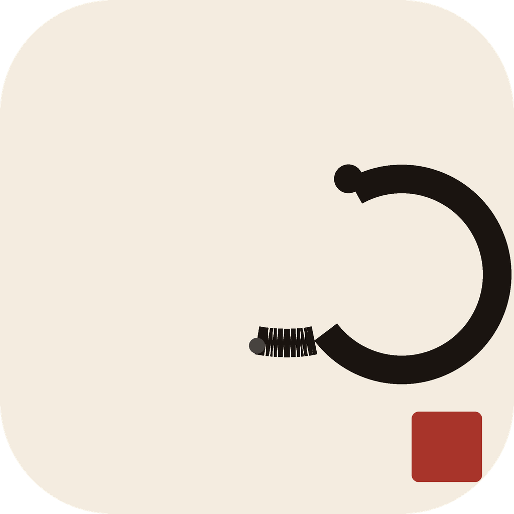

<div align="center">



# 墨 &nbsp; Sumi

*A quiet sudoku practice.*

**Zen Sudoku for Android & iOS — built with Kotlin Multiplatform**

<br/>

[](https://kotlinlang.org)
[](https://www.jetbrains.com/compose-multiplatform/)
[](https://developer.android.com)
[](https://developer.apple.com)

</div>

---

<br/>

> *Ink on paper. No chrome. No streaks.*  
> *Nine by nine, every day.*

Sumi is a daily Sudoku app designed around stillness. No leaderboards, no timers ticking in your face, no gamification noise. Just the grid — ink on warm paper — and the quiet satisfaction of placing the last number.

The name comes from 墨 (*sumi*), the Japanese ink used in traditional calligraphy and painting. The app borrows that aesthetic: a washi-paper texture, warm ink tones, and Japanese typographic accents.

<br/>

---

## Design Identity

<div align="center">

### Colour Palette

| &nbsp; | Token | Hex | Role |
|:---:|:---|:---|:---|
|  | `paper` | `#F4ECE0` | Background — warm washi |
|  | `ink` | `#1A1410` | Primary text & strokes |
|  | `inkSoft` | `#5A4838` | Secondary text |
|  | `red` | `#A8342A` | Accent — vermilion seal |
|  | `inkNight` | `#0F0A07` | Night / pro surface |

</div>

<br/>

### Typography

| Family | Role | Character |
|:---|:---|:---|
| **Cormorant Garamond** | Headlines, wordmark | Italic 500 — the editorial voice |
| **Source Serif 4** | Body copy, UI text | Regular 400 — readable at small sizes |
| **Shippori Mincho** | CJK glyphs (墨 休 完 一…) | Medium 500 — authentic brush weight |
| **Caveat** | Hand-drawn digit accents | Regular 400 — felt-pen energy |

<br/>

### Design System

All visual specifications live in [`docs/handoff/`](docs/handoff/):

| Document | Defines |
|:---|:---|
| [`START_HERE.md`](docs/handoff/START_HERE.md) | Entry point — read before touching UI code |
| [`BACKGROUNDS.md`](docs/handoff/BACKGROUNDS.md) | 5 canonical backgrounds (BG-1 → BG-5), PNG recipe |
| [`screens/`](docs/handoff/screens/) | Per-screen layout, animation, and ink-bleed specs |
| [`VERIFICATION.md`](docs/handoff/VERIFICATION.md) | 12-section grading rubric for every screen |

---

## App Features

| Feature | Detail |
|:---|:---|
| **Daily Puzzle** | One curated puzzle per day — streak tracking builds the habit |
| **Five Difficulty Tiers** | 易 Easy · 中 Medium · 難 Hard · 極 Master · 江 Edo |
| **Pause Without Penalty** | Step away. The grid waits. Timer pauses, progress saved. |
| **Notes Mode** | Pencil in candidates — hold to toggle, tap to erase |
| **Hints** | Three per game. Used sparingly. |
| **Share Result** | Branded card — time, mistake count, streak |
| **No Ads · No Account** | Offline-first. Everything lives on-device. |

---

## Architecture

```
Sumi/
├── composeApp/          ← Shared KMP module (all UI, Android + iOS)
│   └── src/
│       ├── commonMain/  ← Screens, ViewModels, design system
│       ├── androidMain/ ← Android platform hooks
│       └── iosMain/     ← iOS platform hooks
├── androidApp/          ← Android host app (thin wrapper)
├── iosApp/              ← iOS host app (Xcode project)
├── game/                ← Puzzle engine · board logic · solver
├── share/               ← Share-result KMP module
└── docs/handoff/        ← Design system specifications
```

```
composeApp/src/commonMain/
├── theme/          → SumiTokens · SumiTheme · SumiFonts
├── design/
│   └── components/ → WashiBG · SumiButton · SumiBoard · SealComplete …
├── screens/        → One sub-package per screen
├── navigation/
│   └── entries/    → NavEntry composables (own the ViewModels)
├── di/             → Koin modules
└── App.kt          → Root composable
```

**Pattern** — ViewModels live only in `Entry` composables. Screen composables are pure: they receive typed state + callback lambdas, nothing else.

---

## Tech Stack

| Area | Technology |
|:---|:---|
| **UI** | [Compose Multiplatform](https://www.jetbrains.com/compose-multiplatform/) |
| **Language** | Kotlin 2.1 (KMP) |
| **DI** | [Koin](https://insert-koin.io/) |
| **Navigation** | Navigation3 (multi-backstack) |
| **State** | `StateFlow` + `collectAsState` |
| **Persistence** | DataStore (save/resume puzzle state) |
| **Fonts & Resources** | Compose Multiplatform Resources API |
| **Build** | Gradle 8 · Convention plugins · AGP 9 |
| **Quality** | Detekt · iOS + Android compile gates |

---

## Getting Started

### Prerequisites

- JDK 17+
- Android Studio Ladybug or later
- Xcode 16+ (for iOS builds)
- Kotlin Multiplatform Mobile plugin

### Build & Run

```bash
# Android debug APK
./gradlew :composeApp:assembleDebug

# iOS — open iosApp/iosApp.xcodeproj in Xcode, then run
```

### Quality Gate

Run before every merge. All three must pass:

```bash
./gradlew :composeApp:compileKotlinIosSimulatorArm64 \
          :composeApp:compileAndroidMain \
          :composeApp:detekt
```

### Tests

```bash
# Puzzle engine unit tests
./gradlew :game:testAndroidHostTest

# All modules
./gradlew testAndroidHostTest --continue
```

---

## Module Graph

```
androidApp ──► composeApp ──► game
     │               └──► share
     └── (shareModule via Koin)
```

`composeApp` owns all UI and navigation.  
`game` is a pure KMP library — no UI dependency, fully unit-tested.  
`share` provides platform-specific share sheet implementations via `expect/actual`.

---

<div align="center">

<br/>

*"The grid is quiet again."*

<br/>

Made with 墨 · [ksharma-xyz](https://github.com/ksharma-xyz)

</div>
